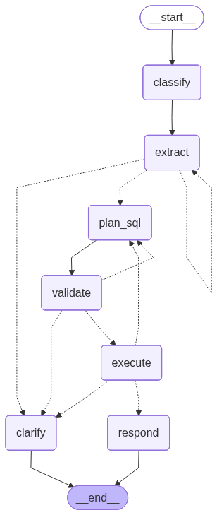

# Cortex — Real Estate Asset Management Assistant

A conversational AI assistant for querying a commercial property portfolio. Ask questions in plain English, get precise answers backed by actual data.

Built with LangGraph, GPT-4o / GPT-5.2, DuckDB, and Streamlit.

---

## Setup

Requirements: Python 3.13, [uv](https://docs.astral.sh/uv/)

```bash
git clone https://github.com/anton-plevako/cortex.git
cd cortex
uv sync
```

Create a `.env` file:

```env
OPENAI_API_KEY=sk-...
LANGSMITH_TRACING=true
LANGSMITH_ENDPOINT=https://api.smith.langchain.com
LANGSMITH_API_KEY=lsv2_...
LANGSMITH_PROJECT=cortex
```

Run the app:

```bash
uv run streamlit run app.py
```

---

## What it does

The system answers natural-language questions about a portfolio of commercial properties. Some examples:

- "Which property made the most money in 2024?"
- "Compare Building 120 and Building 17 for Q4 2024."
- "What are our biggest expense categories in 2024?"
- "Show me Building 160's profit trend across all quarters."
- "How much parking revenue did we earn in 2024?"

Each question is translated into a DuckDB SQL query, executed against the ledger, and narrated back in plain language. When a query is too vague or references an unknown property, the system asks a clarifying question rather than guessing.

The dataset is `data/cortex.parquet` — a P&L ledger for PropCo with 5 properties, 18 tenants, 29 ledger categories, and 15 months of data (2024 full year + Q1 2025).

---

## Architecture

The core idea: all numbers come from SQL execution, not from the LLM. GPT handles language (intent, SQL drafting, narration); DuckDB is the source of truth.

High-level flow:

- `classify` (LLM) extracts `request_type`, `timeframe`, and `raw_properties`
- `validate_and_resolve` (code) resolves properties deterministically and runs guard checks:
  - `unclear` → `CLARIFY_QUERY`
  - invalid timeframe → `FALLBACK_NO_DATA` (terminal)
  - unresolved property names → `CLARIFY_PROPERTY`
  - otherwise routes to SQL
- `sql_agent` ↔ `sql_executor` loops until `execute_sql` returns success or a terminal failure
- `handle_sql_result` decides whether to answer or route into the clarify hub
- Clarify hub handles clarification (`CLARIFY_*`) and terminal failures (`FALLBACK_*`) via `interrupt()` + `MemorySaver` resume

### File layout

```text
src/cortex/
  config.py        — constants and valid time periods loaded from parquet at startup
  state.py         — AssetState TypedDict passed between all nodes
  db.py            — DuckDB connection + schema summary injected into prompts
  tools.py         — execute_sql tool + resolve_property helper
  prompts.py       — all system prompts in one place
  nodes/           — one file per node (incl. clarify hub nodes)
  graph_routes.py  — routing functions (state -> next node)
  graph.py         — graph wiring and compilation
app.py             — Streamlit UI
test_graph.py      — test suite
data/cortex.parquet
```

---

## LangGraph pipeline



Each node has a single job. Routing is driven by state (`next_action`, `error_bucket`, etc.).

**Main path:**

- `classify` (LLM) — classify intent + extract raw slots (property mentions, timeframe, etc.)
- `validate_and_resolve` (code) — resolves `raw_properties` → `properties`, validates timeframe, sets `next_action` + `error_bucket`
- `sql_agent` (LLM) — generate DuckDB `SELECT` + tool-call `execute_sql`
- `sql_executor` (ToolNode) — executes `execute_sql`
- `handle_sql_result` (code) — interprets tool output, sets `next_action` (answer vs clarify)
- `answer` (LLM) — narrates the final result

**Clarify hub (6 nodes):**

- `clarify_entry` (code) — dispatches based on `error_bucket`, attempts, and whether a question is already staged
- `clarify_question` (LLM) — generates the clarification question
- `clarify_interrupt` (`interrupt`) — pauses, stores Q/A, resets messages
- `clarify_policy` (LLM, structured output) — decides: ask again / apply / fallback
- `clarify_apply` (code) — patches `user_query_working` or `raw_properties`, routes back to `validate_and_resolve` or `classify`
- `clarify_fallback` (LLM) — terminal explanation for `FALLBACK_*` or max attempts

**Loops:**

- `sql_agent` ↔ `sql_executor` until SQL is terminal (`ok` / `no_data` / `exec_error`, etc.)
- Clarify hub loops through interrupt/resume until resolved or attempts are exhausted. `pending_question` prevents regenerating questions on reruns. `messages` is reset via `Overwrite([])` after each human answer so the SQL agent restarts clean.

---

## Shared state

All nodes read and write a single `AssetState` TypedDict:

```text
user_query              # original user input (kept as-is)
user_query_original     # immutable copy used for display/narration
user_query_working      # mutable working copy for re-classify / SQL after clarification

request_type            # "pnl" | "comparison" | "details" | "general" | "unclear" | "off_topic"
raw_properties          # extracted property strings (may include unresolved)
properties              # canonical property names (written by validate_and_resolve)

timeframe               # {year, quarter, month}

next_action             # routing signal:
                        # core: "sql" | "answer" | "clarify"
                        # clarify hub: "question" | "policy" | "interrupt" | "apply" |
                        #              "validate" | "classify" | "fallback"

error_bucket            # "CLARIFY_PROPERTY" | "CLARIFY_QUERY" |
                        # "FALLBACK_OFF_TOPIC" | "FALLBACK_NO_DATA" | "FALLBACK_EXEC_ERROR" | ""

tool_result             # {status, error_message, rows, row_count, columns, cleaned_sql}
result                  # final text shown to user
result_type             # "answer" | "fallback" (Streamlit display)

messages                # message history for sql_agent ↔ tool loop (reset after interrupt)
pending_question        # staged question for interrupt() (replay-safe)
last_clarify_question   # last question shown to the user
last_clarify_answer     # user's last answer
clarify_attempts        # incremented on each interrupt; gates MAX_CLARIFY_ATTEMPTS

error_source            # node name where LLM exception occurred (empty on success)
error_detail            # sanitized error: type + first line, no keys/SQL/PII
```

---

## Design decisions

- **Schema injection vs. RAG:** The schema is small but has quirks, so I inject the full schema + rules into every SQL prompt. No retrieval misses, consistent context.

- **Structured output:** Control-flow decisions (intent, slots, clarify policy) use `with_structured_output(PydanticModel)` so state stays typed and routing is deterministic.

- **MemorySaver + interrupt:** Clarifications use LangGraph `interrupt()`. Streamlit resumes with `Command(resume=answer)` on the same `thread_id` so the conversation continues instead of restarting.

- **LLM vs code split:** LLMs handle language (intent, SQL, narration). Code handles correctness (validation, execution, retries, routing).

- **Error handling — two layers:** At the node level, all LLM calls are wrapped with a retry helper that retries only on transient errors (rate limits, timeouts, 5xx). Non-transient failures (schema mismatch, bad request) surface immediately. On exhaustion, nodes return a deterministic fallback state rather than raising. At the graph level, all failure paths route into a single clarify hub, which handles both clarification flows and terminal fallbacks — the graph always ends cleanly with a user-facing message. Diagnostic fields (`error_source`, `error_detail`) are stored in state for tracing.

---

## Challenges & how I solved them

- **Tool-per-intent didn't scale:** Multiple rigid tools (`get_property_pnl`, `compare_properties`, etc.) broke on novel questions. Replaced with a single SQL-generating agent + one tool: `execute_sql`.

- **SQL correctness required explicit conventions:** The ledger has quirks (sign-encoded profit, entity-level costs with `NULL property_name`). I encoded an explicit schema summary + SQL rules + examples directly into the SQL agent prompt. The agent also retries on `bad_sql`.

- **Property matching could silently produce wrong answers:** Fuzzy matching on numeric names is dangerous ("10" → "180"). Fixed with deterministic numeric-first resolution; fuzzy matching only applies to non-numeric inputs.

- **Clarification loops were hard to get right:** Failures bucket into `CLARIFY_PROPERTY`, `CLARIFY_QUERY`, and terminal `FALLBACK_*`. An infinite-loop edge case led me to refactor into discrete nodes (`clarify_entry → clarify_question → interrupt → clarify_policy → clarify_apply/clarify_fallback`). Questions are staged via `pending_question` (replay-safe), messages reset after each answer, and results applied deterministically.

- **Streamlit + interrupt/resume:** Streamlit reruns the full script on each interaction. The graph uses `MemorySaver` with a stable `thread_id`; the UI resumes with `Command(resume=answer)` rather than restarting.
